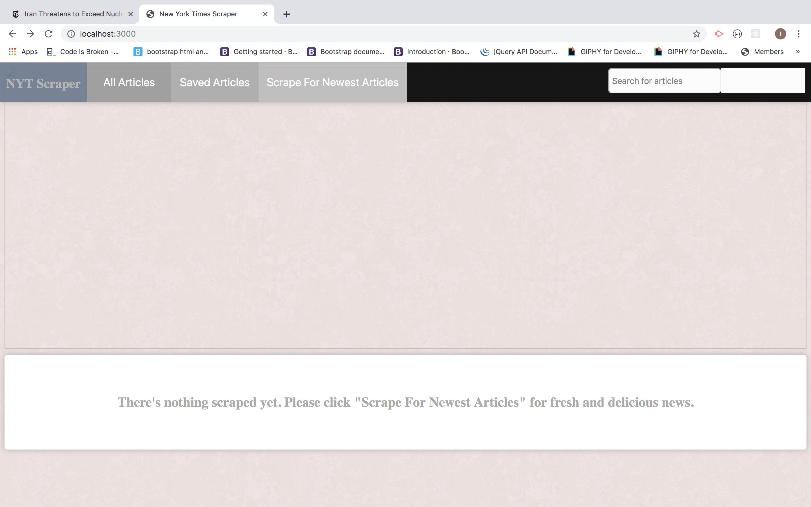
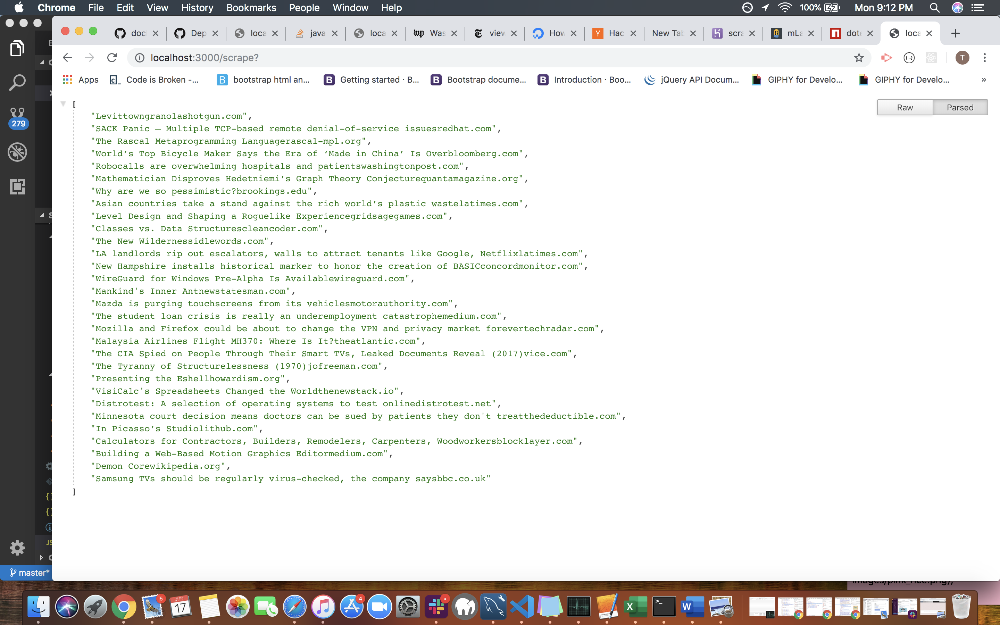
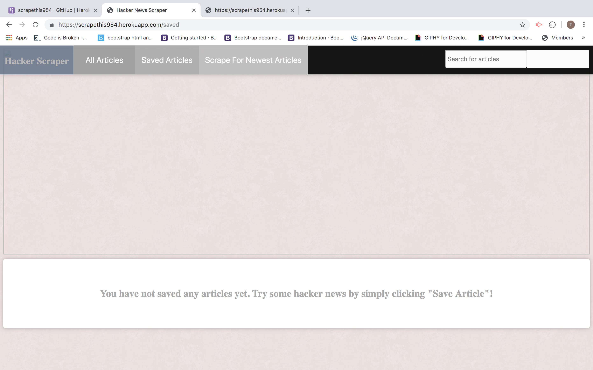
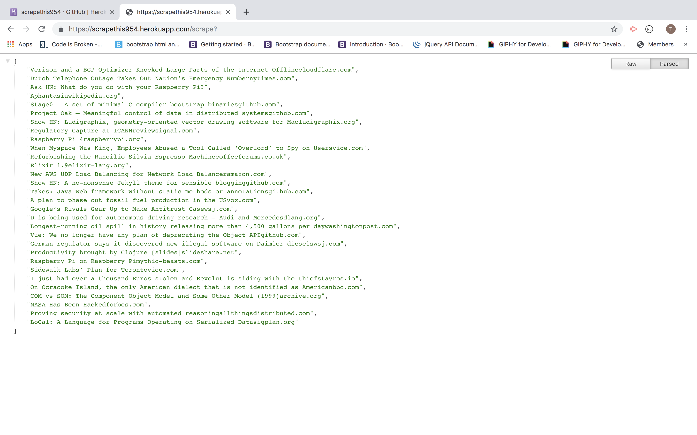

# Scrapethis
# All the News That's Fit to Scrape

### Overview

In this assignment, theoretically I created a web app that lets users view and leave comments on the latest news. But I didn't actually write any articles; instead, I used Mongoose and Cheerio  to scrape news from Hacker News.

### Packages Used:

   1. express

   2. express-handlebars

   3. mongoose

   4. cheerio

   5. axios

* **This assignment must be deployed.** * Please submit both the deployed Heroku link to your homework AND the link to the Github Repository!

## Instructions

* Create an app that accomplishes the following:

  1. Whenever a user visits your site, the app should scrape stories from a news outlet of your choice and display them for the user. Each scraped article should be saved to your application database. At a minimum, the app should scrape and display the following information for each article:

     * Headline - the title of the article

     * Summary - a short summary of the article

     * URL - the url to the original article

* **This assignment must be deployed.** I have attempt to complete homework assignment as described in instructions. I have sent all of my github updates to Heroku in an attempt to deploy the app. It currently runs on the local 3000 host when you hit the Scrape for the Newest Articles Button. I am proud of this bc I worked over 40 hours on this with help from other students, TA's, and our substitute teacher. It is not a complete assignment, but I know in the future I can start over from scratch with more knowledge and make it work. 

* [Heroku](https://scrapethis954.herokuapp.com/)

* [Github](https://github.com/tracycobrien/scrapethis.git)

---

 